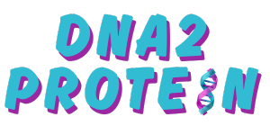

# 🧬 DNA2Protein

  

**DNA2Protein** is a Python-based educational tool that simulates gene expression — going from a DNA strand to a visual representation of proteins. It models **transcription**, **translation**, and displays the resulting proteins using **Turtle graphics**.

🧪 This project was developed for [CodeBoot](https://codeboot.org/5.3.1/), the Python environment used at **Université de Montréal**.

---

## 🎯 What It Does

- 🧬 Generates the **complementary DNA strand**  
- 🔍 Detects **start codons** (`TAC`) and **stop codons** (`ATT`, `ATC`, `ACT`)  
- 📦 Extracts **genes** (start-to-stop sequences)  
- 🔁 Performs **transcription** (DNA → RNA)  
- 🔡 Translates RNA into **amino acid sequences**  
- 🐢 Uses Turtle to **draw the protein chains** with letter-coded amino acids  

---

## 🚀 How to Run (in CodeBoot)

> ✅ This program must be run inside the [CodeBoot](https://codeboot.org/5.3.1/) environment, where Python + Turtle graphics are supported.

### Instructions

1. Open[CodeBoot](https://codeboot.org/5.3.1/)
2. Paste the contents of `project.py` into the CodeBoot editor  
3. Click “▶ Run” 
4. The amino acid sequences will appear in the terminal, and the Turtle window will display the proteins visually.

---

## 📁 Project Structure

- `project.py` – Main script with all logic and drawing code  
- `assets/` – Optional images for documentation (e.g., logo, university seal)  
- `README.md` – Project overview and instructions  

---

## 🧩 Technologies Used

- **Python 3 (CodeBoot-compliant subset)**  
- **Turtle graphics** (for drawing amino acids)  
- **Dictionaries** (for codon translation and protein representation)

---

## 🧪 Sample Output

- **Console:**  
  Displays translated amino acid sequences (e.g., `Methionine - Tyrosine - Glycine`)  

- **Turtle Graphics:**  
  Visualizes each protein as a chain of letters inside drawn squares, organized into readable lines

---

© 2024 **DNA2Protein** | Built by Tidjani. All rights reserved.
